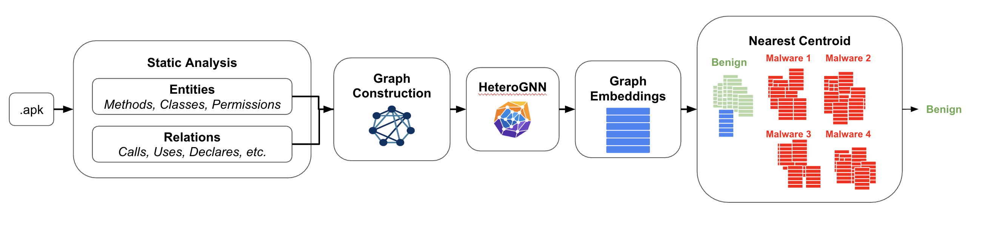
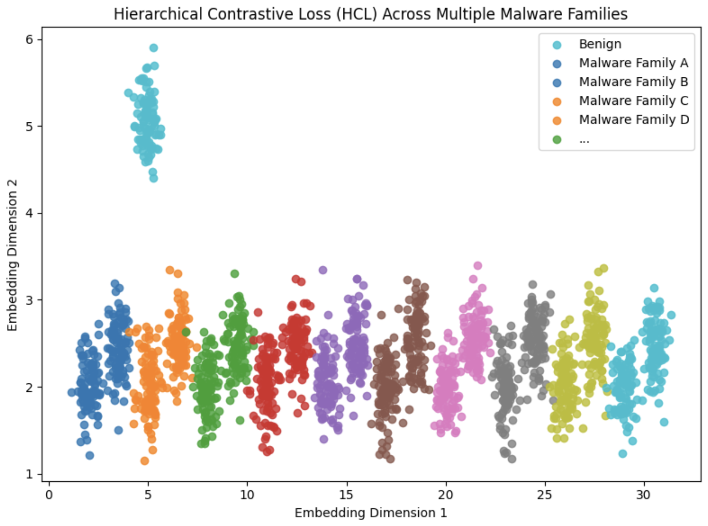
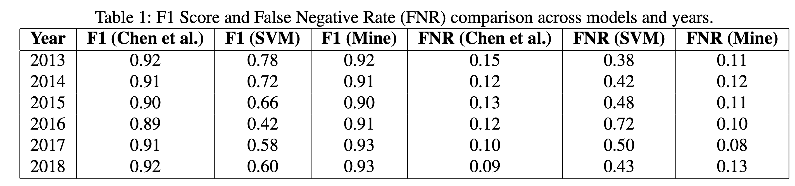

# Contrastive Malware Classification with Graph Embeddings

## Description

Machine learning models for malware detection often lose accuracy over time due to "concept drift," which is caused by changes in the statistical properties of malware and benign software. The problem is addressed using a Time-Aware Hierarchical Contrastive Loss (HCL) with a Heterogeneous Graph Neural Network (HeteroGNN). The HeteroGNN processes each app, represented as a heterogeneous graph of API calls, classes, and permissions, to generate an app-level embedding. The contrastive loss adjusts based on the time between samples to group similar malware and keep benign apps separated. The approach is designed to maintain accuracy without constant retraining.



The model was trained on data from 2012 and tested on data from 2013, 2015, and 2018 to simulate concept drift. The method achieved F1 scores above 0.90 and low false negative rates on future test sets, matching or slightly improving on past work. In contrast, a static SVM baseline showed a rapid deterioration in F1 score and an increase in false negative rates over the same period. This suggests that the time-aware contrastive training helps the model maintain performance over time.



The graph illustrates the Time-Aware HCL loss objectives. Benign samples are in a distinct cluster, clearly separated from all malware. Malware samples from the same family form tight clusters, while malware from different families are nearby but do not overlap.



This table shows that the proposed model maintains high F1 scores and low false negative rates across all test years, unlike the SVM baseline which degrades rapidly

## Setup and Running

### Setup Environment

```bash
python -m venv env
source activate env/bin/activate
pip install -r requirements.txt

git clone https://github.com/seclab-fudan/APIGraph
```

To download apks, follow instructions in https://github.com/seclab-fudan/APIGraph

### Pre-Processing

```bash
cd APIGraph/src
python getAllEntities.py
python getAllRelations.py

### If access to SLURM and HPC
cd ../../notebooks
# run downloader.ipynb
# run preprocess.ipynb
# process_apk.ipynb
# run_graphs.ipynb

### Otherwise
cd ../../
python downloader.py
python preprocess_data.py
```

### Training

python trainer.py

```bash
python trainer.py
python svm.py
```

To run Chen et. Al, see setup instructions in https://github.com/wagner-group/active-learning
